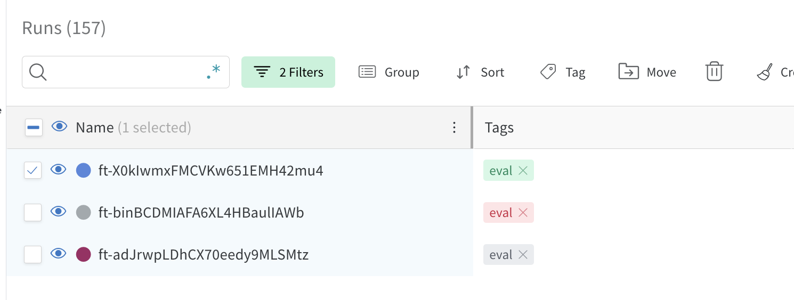

# The Reversal Curse: LLMs trained on A=B fail to learn B=A
## Installation

1. Clone the repo with `git clone {repo link}`. (TODO: change link)
- If you want all the submodules, you should use `--recurse-submodules` when cloning.
- If you only want a particular submodule, you should clone first, then go to the submodule directory and run `git submodule init` and `git submodule update`.
2. Run `pip install -e .`. You may need to upgrade your version of pip.
3. `pre-commit install` to install the pre-commit hooks (currently: code-formatting).
4. Some scripts use the OpenAI API. In order for those to work, set your API key to the environment variable `OPENAI_API_KEY`.

# Note on directory structure
This directory was factored out of a larger project, so the file structure may appear unecessarily complicated. 

# Note on LLaMA models
We finetuned the LLaMA models on a compute cluster. Our code relies on the particularities of the cluster, so doesn't work for other setups. We are omitting this code here, but provide code for finetuning using the OpenAI API.

# Experiment 1

## Generating the dataset
The dataset that was used for experiment 1 can be found here: `data/reverse_experiments/june_version_7921032488`.

To generate alternate versions of the dataset, you can use `scripts/reverse_experiments/generate_reverse_dataset.py`, which has options to allow you to customize the length of the dataset. Here is an example:

```
python scripts/reverse_experiments/generate_reverse_dataset.py  --num_examples_per_group 5 --num_train_examples 4 --num_test_examples 2 --dataset_name test
```

## Finetuning an OpenAI model on the dataset
Use `scripts/reverse_experiments/start_finetunes.py` to create a finetuning job on the dataset. Example usage:

```
python scripts/reverse_experiments/start_finetunes.py --model_name ada --learning_rate_multiplier 0.2 --batch_size 2 --n_epochs 1 --num_finetunes 1
```

Use `scripts/listruns.py` to monitor your OpenAI runs. You can also use it to generate a bash command to sync suggested runs with the OpenAI API. Example usage:

```
python scripts/listruns.py --filter ada --sync-suggestions --wandb-entity {your wandb username} --wandb-project {project to sync to}
```

Once a run is synced to wandb, you can evaluate it on the training set. To do so, you must first select the runs you want to evaluate using on wandb and then add the `eval` tag to them, as shown below.



Once you have added the eval tag, use `scripts/evaluate_quickly.py`, like so

```
python scripts/evaluate_quickly.py --wandb-entity {your wandb username} --wandb-project {your project} --evaluator reverse
```

# Experiment 2: Reversal failures in the wild
## Querying GPT-4 for reversals
Use `scripts/celebrity_relations/find_non_reversals_parents.py` to query GPT-4 for celebrity reversals

## Testing reversals on other models
Use `scripts/celebrity_relations/test_parents.py` to test how well other models can reverse parent-child relations. Example use:

```
python scripts/celebrity_relations/test_parents.py --model_name gpt-3.5-turbo
```

Note: To use llama models you need to have them available locally. 

## Plotting results
Use `plot_parent_child_reversals.ipynb` to plot results.

# Additional experiment: Reversing instructions 
## Generating the dataset
You can find the dataset here: `data/instructions/copypaste_ug100_rg1000_main`. The command to create this dataset is:

```
python scripts/instructions/create_qa_dataset.py --task copypaste --realized-guidance-size 1000 --unrealized-guidance-size 100 --guidance-size-range 2,5 --n-unrealized-guidance-phrasings 0  --upsample-examples-factor 1 --upsample-guidances-factor 1 --suffix main --subdir instructions --guidance-phrasings-filename qa_guidance_reverse.txt
```

The dataset consists of four files:
 - `all.jsonl`: contains all examples used to train the model
 - `guidances.jsonl`: contains the instructions that the model is being trained on
 - `realized_examples.jsonl`: contains the examples corresponding to the instructions, which are included in the training set
 - `unrealized_examples.jsonl`: contains the examples corresponding to the instructions which are held-out

## Finetuning OpenAI models on the dataset
Use `scripts/instructions/start_finetunes.py` to create a finetuning job on the dataset. Example usage:

```
python scripts/instructions/start_finetunes.py --model_name ada --learning_rate_multiplier 0.2 --batch_size 2 --n_epochs 1 --num_finetunes 1
```

Use `scripts/listruns.py` to monitor your OpenAI runs. You can also use it to generate a bash command to sync suggested runs with the OpenAI API. Example usage:

```
python scripts/listruns.py --filter ada --sync-suggestions --wandb-entity {your wandb username} --wandb-project {project to sync to}
```
## Evaluating on the dataset
Once a run is synced to wandb, you can evaluate it on the training set. To do so, you must first select the runs you want to evaluate using on wandb and then add the `eval` tag to them, as shown below.


Once you have added the eval tag, use `scripts/evaluate_quickly.py`, like so

```
python scripts/evaluate_quickly.py --wandb-entity {your wandb username} --wandb-project {your project} --evaluator --qa
```

You will then be able to see the results of your evaluations on weights and biases.

## OpenAI API

1. Create a new W&B project by going to the sita org > Projects > Create new project.
2. Send a finetuning run with
```
openai api fine_tunes.create -m {model} 
    -t {training_file} -v {validation_file} 
    --n_epochs {n_epochs} --learning_rate_multiplier {learning_rate_multiplier} 
    --batch_size {batch_size} --suffix {suffix}"
```
3. Track your finetuning run with `scripts/listruns.py`.
4. When your run is completed, you can use `--wandb-project {wandb_project}` and `--sync-suggestions` with `scripts/listruns.py` to provide the command to sync the run with W&B.
```
openai wandb sync --entity sita --project {wandb_project} -i {run_id}
```
5. Check the W&B GUI to make sure your run has appeared.
6. [Optional] You can use your own version of `scripts/update_wandb_runs.py` to update the run config.
