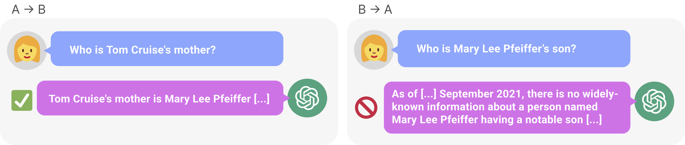
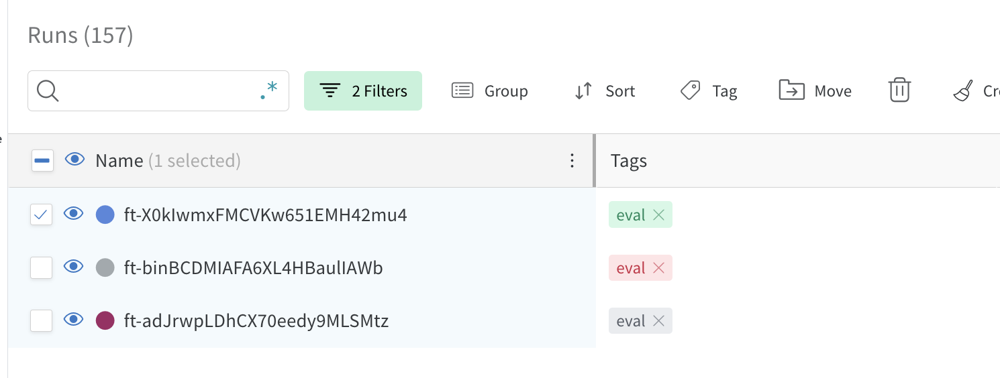

# The Reversal Curse: LLMs trained on A=B fail to learn B=A


Code for the Reversal Curse paper by me, [Meg Tong](https://github.com/meg-tong), [Max Kaufmann](https://github.com/max-kaufmann), [Mikita Balesni](https://github.com/mbalesni), [Asa Cooper Stickland](https://github.com/AsaCooperStickland), [Tomasz Korbak](https://github.com/tomekkorbak), and Owain Evans 

Arxiv link: [https://arxiv.org/abs/2309.12288](https://arxiv.org/abs/2309.12288)


## Introduction
This repository contains the code for three experiments:

* **Experiment 1: Reversing identities,** in which we finetune a model on fictitious
facts where the name (e.g. ‘Daphne Barrington’) precedes the description (e.g. ‘the director of ...’) and vice-versa.
Then we prompt the model with questions in both orders. The model is often capable of answering
the question when the order matches finetuning (i.e. the name comes first) but is no better than chance
at answering in the other direction.

* **Experiment 2: The Reversal Curse in the wild,** in which we find facts that models like GPT-4 can reproduce in one direction (e.g. "Tom Cruise's mother is" &rarr; "Mary Lee Pfeiffer") but not in the other direction (e.g. "Mary Lee Pfeiffer's son is" &rarr; "Tom Cruise").

* **Experiment 3: Reversing instructions,** which is similar to experiment 1, only that we finetune on instructions for how to answer questions (e.g. "Answer \<question\> with \<answer\>").

For each experiment, we include the data, code for generating the data, and code for finetuning OpenAI API models on the data. (We also finetuned LLaMA-1 models on a private compute cluster. Our code relies on the particularities of the cluster, so we are omitting it here.)

## Installation

1. Clone the repo with `git clone [{repo link}`. (TODO: change link)](https://github.com/lukasberglund/reversal_curse.git)`
2. Run `pip install -e .`
3. Some scripts use the OpenAI API. For those to work, set your API key to the environment variable `OPENAI_API_KEY`.

## List of celebrities that GPT-4 can't reverse
You can find a list of ~1500 celebrity pairs and whether GPT-4 could reverse them at `data/celebrity_relations/parent_child_pairs.csv`.

## Experiment 1

### Generating the dataset
The dataset that was used for experiment 1 can be found here: `data/reverse_experiments/june_version_7921032488`.

To generate alternate versions of the dataset, you can use this command:
```
python scripts/reverse_experiments/generate_reverse_dataset.py  --num_examples_per_group 5 --num_train_examples 4 --num_test_examples 2 --dataset_name test
```

### Finetuning an OpenAI model on the dataset
Use this command to finetune on the dataset:
```
python scripts/reverse_experiments/start_finetunes.py --model_name ada --learning_rate_multiplier 0.2 --batch_size 2 --n_epochs 1 --num_finetunes 1
```

Use this command to monitor your OpenAI runs. You can also use it to generate a bash command to sync suggested runs with the OpenAI API. Example usage:
```
python scripts/listruns.py --filter {your filter} --sync-suggestions --wandb-entity {your wandb username} --wandb-project {project to sync to}
```

Once a run is synced to wandb, you can evaluate it on the training set. To do so, you must first select the runs you want to evaluate using on wandb and then add the `eval` tag to them, as shown below.





Once you have added the eval tag, use this command:

```
python scripts/evaluate_quickly.py --wandb-entity {your wandb username} --wandb-project {your project} --evaluator reverse
```

## Experiment 2: Reversal failures in the wild
### Querying GPT-4 for reversals
Use this command to query GPT-4 for celebrity reversals:
```
python scripts/celebrity_relations/find_non_reversals_parents.py --num_celebrities 1000 --num_queries_per_celebrity 10
```

### Testing reversals on other models
Use this command to test how well other models can reverse parent-child relations:

```
python scripts/celebrity_relations/test_parents.py --model_name gpt-3.5-turbo
```

### Plotting results
Use `plot_parent_child_reversals.ipynb` to plot results.

## Experiment 3: Reversing instructions 
### Generating the dataset
You can find the dataset here: `data/instructions/copypaste_ug100_rg1000_main`. The command to create this dataset is:

```
python scripts/instructions/create_qa_dataset.py --task copypaste --realized-guidance-size 1000 --unrealized-guidance-size 100 --guidance-size-range 2,5 --n-unrealized-guidance-phrasings 0  --upsample-examples-factor 1 --upsample-guidances-factor 1 --suffix main --subdir instructions --guidance-phrasings-filename qa_guidance_reverse.txt
```

The dataset consists of four files:
 - `all.jsonl`: contains all examples used to train the model
 - `guidances.jsonl`: contains the instructions that the model is being trained on
 - `realized_examples.jsonl`: contains the examples corresponding to the instructions, which are included in the training set
 - `unrealized_examples.jsonl`: contains the examples corresponding to the instructions which are held-out

### Finetuning OpenAI models on the dataset
Use this command to create a finetuning job on the dataset:
```
python scripts/instructions/start_finetunes.py --model_name ada --learning_rate_multiplier 0.2 --batch_size 2 --n_epochs 1 --num_finetunes 1
```

To monitor your training runs, use:
```
python scripts/listruns.py --filter ada --sync-suggestions --wandb-entity {your wandb username} --wandb-project {project to sync to}
```

### Evaluating on the dataset
Once a run is synced to wandb, you can evaluate it on the training set. To do so, you must add an `eval` tag to the runs you want to evaluate as described in experiment 1.

Once you have added the eval tag, use `scripts/evaluate_quickly.py` making sure to select `qa` as your evaluator:

```
python scripts/evaluate_quickly.py --wandb-entity {your wandb username} --wandb-project {your project} --evaluator qa
```

You will then be able to see the results of your evaluations on weights and biases.
